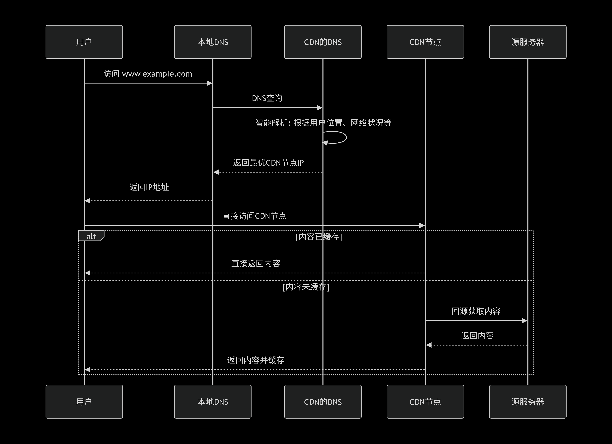

# 域名
网络地址的名称

## 衍生名词
**根域名**：最高层级，在域名末尾用一个点表示，比如www.baidu.com.中最后的那个点
**顶级域名**：根域名之下的第一级域名，位于一个完整域名的最后一部分
**二级域名**：顶级域名左侧的部分
**多级域名**：在二级域名左侧继续添加前缀，形成的更深层次的域名。通常也被称为“子域名”
eg:www.example.com 中的 www 就是一个最常见的三级域名。它传统上代表万维网服务。

发现多级域名的意义：为后续的漏洞扫描、渗透测试提供目标基础

# DNS
域名系统（服务）协议，主要用于域名和ip地址的相互转换

## 本地HOSTS与DNS的关系
本地hosts文件作用：本地的域名解析，优先级高于DNS解析结果

工作流程：
1.应用程序请求解析一个域名（例如www.example.com）。
2.系统首先检查本地hosts文件，如果找到对应记录，则返回IP地址。
3.如果hosts文件中没有找到，系统会查询DNS缓存，如果缓存中有记录，则返回IP地址。
4.如果缓存中没有，系统会向配置的DNS服务器发送查询请求。
5.DNS服务器返回IP地址，系统将该记录缓存，并将IP地址返回给应用程序。
因此，通过修改hosts文件，可以覆盖DNS解析结果

## CDN作用及其与DNS的关系
CDN：内容分发网络，通过设立边缘节点来把内容高效地分发给用户

安全方面作用：
1. **DDoS 防护**
- 流量被分散到多个CDN节点
- 具备强大的清洗能力

2. **隐藏源站IP**
- 攻击者只能看到CDN节点IP
- 源服务器真实IP被保护

3. **WAF 功能**
- 集成Web应用防火墙
- 过滤恶意请求